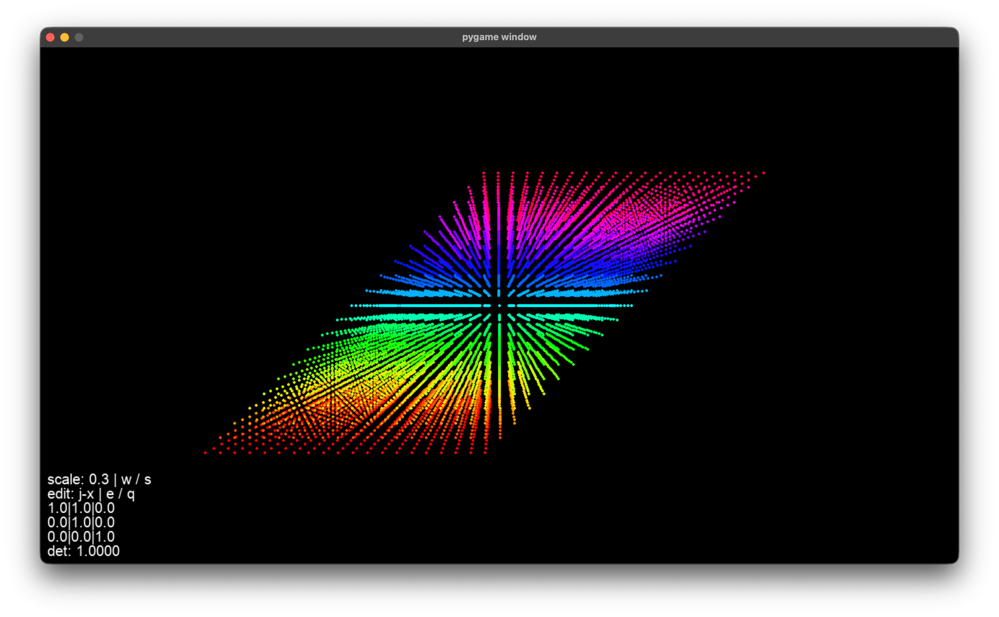
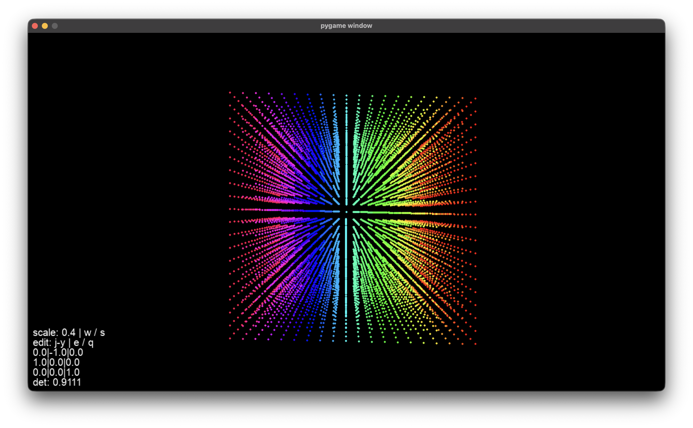

## 3D Matrix & Transformation Visualizer
A lightweight, real-time 3D dot-grid renderer built from scratch in Pygame. It dynamically demonstrates linear transformations, 3D rotations, and determinants without external heavy math libraries.
------------------------------
## Features & Controls

* Mouse — Rotate camera (Pitch / Yaw) via mouse.
* W / S — Scale the object.
* I, J, K + X, Y, Z — Select a specific basis vector and its axis component.
* E / Q — Dynamically increment / decrement the selected matrix value.
* R — Reset rotation and transformations.
* C — Reset the currently selected matrix cell.
* ESC — Close program.

------------------------------
## Visual Demonstration
## 1. Shear

## 2. Rotation

Modify the basis vectors values and watch how the matrix changes its form.
------------------------------
## Installation & Run

   1. pip install pygame
   
   2. python main.py